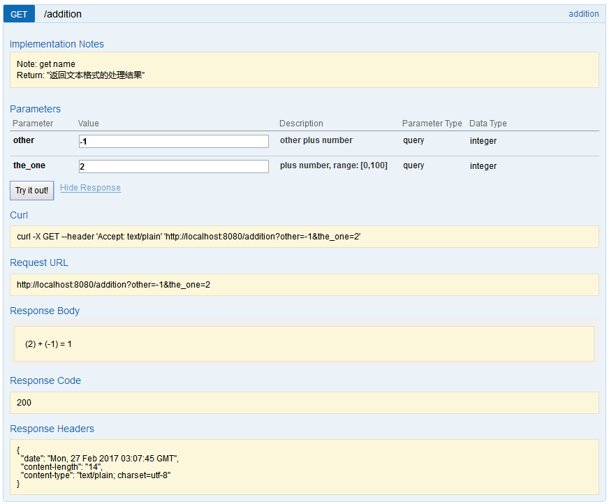

## 4.3 Swagger2.0在线API文档

API文档信息可以从两个地方获取，一个是struct Handler的字段标签中定义，一个是通过实现APIHandler接口来定义。

APIHandler接口定义的相关源码：

```
type (
	// Handler is the main Faygo Handler interface.
	Handler interface {
		Serve(ctx *Context) error
	}
	// APIHandler is the Faygo Handler interface,
	// which is implemented by a struct with API descriptor information.
	// It is an intelligent Handler of binding parameters.
	APIHandler interface {
		Handler
		APIDoc
	}
	// APIDoc provides the API's note, result or parameters information.
	APIDoc interface {
		Doc() Doc
	}
	// Doc api information
	Doc struct {
		Note   string      `json:"note" xml:"note"`
		Return interface{} `json:"return,omitempty" xml:"return,omitempty"`
		Params []ParamInfo `json:"params,omitempty" xml:"params,omitempty"`
	}
	// Notes implementation notes of a response
	Notes struct {
		Note   string      `json:"note" xml:"note"`
		Return interface{} `json:"return,omitempty" xml:"return,omitempty"`
	}
	// ParamInfo is the request parameter information
	ParamInfo struct {
		Name     string      // Parameter name
		In       string      // The position of the parameter
		Required bool        // Is a required parameter
		Model    interface{} // A parameter value that is used to infer a value type and as a default value
		Desc     string      // Description
	}
)
```

### 4.3.1 函数类型Handler定义API信息

为func Handler添加API文档信息，使用辅助函数`faygo.WrapDoc()`进行封装，得到满足APIHandler接口的对象：

```
// 参数fn为预增加API信息的Handler函数，
// 参数note是API接口说明，
// 参数ret为API返回结果示例，
// 不定参parms为API请求参数信息
func WrapDoc(fn HandlerFunc, note string, ret interface{}, params ...ParamInfo) Handler
```

示例：

```
var AdditionHandler = faygo.WrapDoc(
	faygo.HandlerFunc(func(ctx *faygo.Context) error {
		return ctx.String(200, "faygo")
	}), // Handler
	"get name", // API接口说明
	"faygo",    // 响应示例
	// 参数定义
	faygo.ParamInfo{
		Name:     "the_one",
		In:       "query",
		Required: true,
		Model:    int(0),
		Desc:     "plus number, range: [0,100]",
	},
	faygo.ParamInfo{
		Name:     "other",
		In:       "query",
		Required: true,
		Model:    int(0),
		Desc:     "other plus number",
	},
)
```

运行服务后打开API在线文档：
```
http://localhost:8080/apidoc
```

测试该API接口：



### 4.3.2 结构体类型Handler定义API信息

### 4.3.3 相关ini配置

Swagger2.0API在线文档的默认访问路径为：
```
/apidoc
```

## links

* [目录](<../README_ZH.md>)
* 上一节: [4.2 结构体类型Handler](<04.02.md>)

